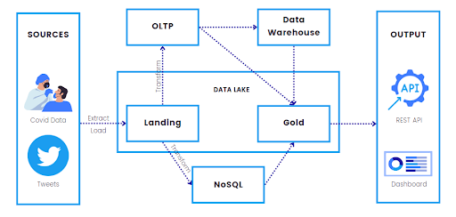

# CovidWatch: Data Architecture for Tracking COVID Statistics and Sentiments

Data Engineering Final Project Patrick Guillano La Rosa, Christian Alfred Soriano, and Samuelson Anthony Sylim- June 23, 2022. Screenshot of codes and setup can be found in <a href="https://github.com/pgplarosa/Data-Architecture-for-Tracking-COVID-Statistics-and-Sentiments/blob/main/Implementation.pdf">Implementation</a>. At the same time, the analysis and Full report can be found in <a href="https://github.com/pgplarosa/Data-Architecture-for-Tracking-COVID-Statistics-and-Sentiments/blob/main/LT9%20DE2022%20Final%20Project%20Technical%20Report.pdf">Technical Report</a>.

## Executive Summary

Despite the rising number of daily COVID-19 cases worldwide and the clear role that vaccines play in reducing mortality rates, vaccine hesitancy remains a persistent issue. Hence, having knowledge of people’s sentiments towards vaccines in addition to relevant COVID infection statistics may just be what policymakers and health authorities need in determining necessary actions.

Given this need, we propose CovidWatch, an automated end-to-end database solution that extracts reliable data on COVID statistics and people’s sentiments on a daily basis and provides policymakers and health analysts the means to derive meaningful and actionable insights through a visualization tool and an API endpoint.

CovidWatch currently has two main sources of data - Our World in Data (OWID) for COVID-related statistics and Twitter for obtaining social media data from which sentiments are extracted. Meanwhile, CovidWatch’s architecture was designed with consideration to the system’s scalability, evolvability and simplicity. Utilizing managed database solutions provided by AWS, CovidWatch has the following components:

<ul>
<li>OLTP Database - although the RDS database is currently being updated daily, CovidWatch is envisioned to eventually draw from different sources in real-time, at which point updates will be done the moment new data (vaccination rates, cases, deaths, etc.) is received.</li>
<li>OLAP Database - The Redshift database enables faster querying with its columnar format and allows dimensional analysis with its location and time dimension tables. This provides policymakers and stakeholders suitable statistics that apply to their jurisdiction and use case.</li>
<li>NoSQL Database - the schemaless design of the NoSQL database enables preservation of all tweet information and provides maximum flexibility by allowing use cases beyond the sentiment analysis employed in this project.</li>
<li>Data Lake - CovidWatch’s S3 data lake, through its two zones, maximizes useability of the data it collects. The gold zone enables business analysts to easily extract meaningful insights from easy-to-use purpose-built data. Meanwhile, the landing zone preserves unaltered information for use by data scientists in advanced analytics and machine learning work.</li>
<li>Scheduled ETL Jobs - DAGs implemented on Airflow perform the automated daily update of all the databases. For COVID data, DAGs download the data, perform ETL, and store the processed data on RDS, Redshift, and the S3 data lake . Meanwhile, another set of DAGs scrape tweets, perform sentiment analysis using Comprehend, and store results on both the S3 data lake and DynamoDB.</li>
<li>Dashboard - A Quicksight dashboard which updates automatically with the data is provided to analysts to aid in decision making. This dashboard not only provides valuable COVID statistics and sentiment data in just a few clicks, but also allows for limited machine learning capability.</li>
<li>API - Access is also provided to the general public through a REST API, enabling them to take advantage of the raw data for any value-adding use case.</li>
</ul>

Although CovidWatch serves its purpose of providing covid-related information, many improvements can still be made. Sentiment data can be expanded to include data from other sources like GDELT and Facebook posts. Meanwhile, COVID data can be more granular by sourcing information from individual sources (e.g. hospitals, cities, etc.). Despite these limitations, we firmly believe that CovidWatch remains to have the potential to improve the perception of vaccines and align policy with public opinion by providing accessibility of information surrounding covid and vaccines through the use of data engineering tools.

